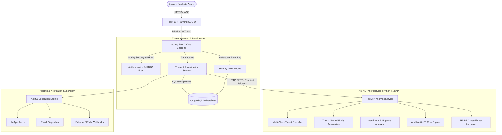

<div align="center">

# 🛡️ ThreatTrace AI

### Enterprise-Grade AI-Assisted Threat Intelligence & Threat Analysis Platform

[](https://github.com/Cy-prog/ThreatTrace-AI/actions/workflows/ci.yml)
[](https://github.com/Cy-prog/ThreatTrace-AI/actions/workflows/security.yml)
[](https://github.com/Cy-prog/ThreatTrace-AI/actions/workflows/docker.yml)
[](LICENSE)
[](https://openjdk.org/projects/jdk/21/)
[](https://spring.io/projects/spring-boot)
[](https://fastapi.tiangolo.com/)
[](https://react.dev/)

*A technically credible, production-oriented platform built for Security Operations Centers (SOCs), cyber threat intelligence teams, defense analysts, and security researchers.*

[System Architecture](#-system-architecture) •
[Core Principles](#-core-architectural-principles) •
[Quickstart](#-quickstart-guide) •
[Default Credentials](#-default-demo-credentials) •
[API Reference](#-api-reference--ingestion) •
[Verification](#-testing--quality-assurance)

</div>

---

## 📌 Executive Overview

**ThreatTrace AI** is a multi-tier, event-driven threat intelligence analysis and triage platform designed to ingest raw unstructured communications (dark web forums, OSINT feeds, encrypted channels, tip-lines), identify threat categories, extract actionable intelligence entities, score operational risk, and detect cross-incident campaign linkages.

Unlike black-box autonomous systems, ThreatTrace AI enforces **assistive, non-autonomous human-in-the-loop intelligence**. AI models generate structured hypotheses, explainable risk factor breakdowns, and correlation suggestions, while verified security analysts retain sole authority over triage dispositions, alert escalation, and remediation workflows.

```
┌────────────────────────────────────────────────────────────────────────────────┐
│                           THREATTRACE AI PLATFORM                              │
├────────────────────┬─────────────────────────────┬─────────────────────────────┤
│  Ingestion Layer   │     AI Inference Engine     │    SOC Analyst Interface    │
│  - Raw OSINT Feeds │  - Multi-Class Classifier   │  - Real-time Threat Triage  │
│  - Dark Web Tips   │  - NER Entity Extraction    │  - Investigation Dossiers   │
│  - SIGINT Reports  │  - Additive Risk Engine     │  - Campaign Correlation Map │
│  - Webhook Ingest  │  - TF-IDF Cosine Clusters   │  - Immutable Audit History  │
└────────────────────┴─────────────────────────────┴─────────────────────────────┘
```

---

## 🏛️ System Architecture

ThreatTrace AI follows a strict clean microservices architecture separated into an ingestion/analysis pipeline, a high-throughput relational backend, an NLP/ML inference service, and a responsive dark-themed SOC operations frontend.



---

## 📐 Core Architectural Principles

### 1. Non-Autonomous Explainable Intelligence
- AI predictions are **never** treated as definitive facts.
- Every classification score outputs a confidence level and categorical label.
- Every entity extraction provides span indices and extraction classification (`LOCATION`, `TARGET`, `WEAPON`, `ACTOR`, `CRYPTO`, `TIME`).
- If the AI microservice is unavailable, the backend gracefully falls back to a deterministic, regex-based keyword heuristics engine without halting system ingestion.

### 2. Transparent Additive Risk Scoring (0–100)
Risk scores are calculated via a strictly transparent, deterministic additive model with granular audit justification:
- **Baseline Threat Category Weight** (0–35 pts): Bomb/Explosive (+35), Active Shooter (+35), Biological/Chemical (+30), Cyber Infrastructure (+25), Extortion (+20), Benign (0).
- **Urgency & Imminence Weight** (0–25 pts): High urgency keywords (+20–25), Medium (+10–15), Low (0).
- **Named Entity Multiplier** (0–20 pts): Specific targets identified (+10), specific weapons/tactics named (+10).
- **Historical Sentiment & Hostility** (0–20 pts): High hostility sentiment (+15–20).
- Total capped at 100 with explicit tier assignments:
  - `0 - 29`: **LOW**
  - `30 - 59`: **MEDIUM**
  - `60 - 79`: **HIGH**
  - `80 - 100`: **CRITICAL**

### 3. Zero-Inference Geolocation Policy
- Coordinates (latitude/longitude) are **never hallucinated or inferred by LLMs**.
- Map coordinates are populated exclusively when:
  1. Ingestion payload provides explicit decimal coordinates, OR
  2. Verified coordinates match a curated gazetteer of public safety infrastructure facilities.
- Unlocated threats display `Coordinates Not Disclosed` with an explicit geocoding badge.

### 4. Immutable Audit Trail & Zero-Trust RBAC
- Every read, write, triage change, status transition, and export triggers an immutable row in `audit_logs`.
- Logs record the authenticated `user_id`, username, role, client IP address, action code, entity ID, and structured JSON diff payload.
- Server-enforced Role-Based Access Control (RBAC) isolates permissions across 4 distinct organizational roles.

---

## 🛠️ Technology Stack

| Layer | Technologies & Frameworks |
| :--- | :--- |
| **Frontend** | React 18.3, TypeScript, Vite, Tailwind CSS, Lucide Icons, Leaflet / React-Leaflet, Recharts |
| **Backend API** | Java 21, Spring Boot 3.3.4, Spring Security 6, Spring Data JPA, Hibernate, Bucket4j |
| **AI / NLP Microservice** | Python 3.11+, FastAPI, Uvicorn, Scikit-learn, NLTK, TextBlob, Pydantic v2 |
| **Database & Migrations** | PostgreSQL 16, Flyway Database Migrations (V1 through V5) |
| **Security & Auth** | JSON Web Tokens (HMAC-SHA256), BCrypt Password Hashing, CORS, Rate Limiting |
| **DevOps & Containers** | Docker, Multi-Stage Dockerfiles, Docker Compose, GNU Makefile, GitHub Actions |

---

## 🚀 Quickstart Guide

### Option A: Complete Multi-Container Deployment via Docker Compose (Recommended)

To start the entire ThreatTrace AI ecosystem (PostgreSQL, AI Service, Spring Boot Backend, and React Frontend):

```bash
# 1. Clone the repository
git clone https://github.com/Cy-prog/ThreatTrace-AI.git
cd ThreatTrace-AI

# 2. Copy the environment template
cp .env.example .env

# 3. Spin up all multi-tier services
docker compose up -d --build

# 4. Verify system health
bash scripts/health-check.sh
# Or in PowerShell:
# .\scripts\health-check.ps1
```

Once running, access the interfaces:
- **Frontend SOC UI**: [http://localhost:5173](http://localhost:5173) (or `http://localhost:3000`)
- **Spring Boot Backend REST API**: [http://localhost:8080](http://localhost:8080)
- **Actuator Health Endpoint**: [http://localhost:8080/actuator/health](http://localhost:8080/actuator/health)
- **FastAPI AI Docs & Swagger**: [http://localhost:8000/docs](http://localhost:8000/docs)

---

### Option B: Local Bare-Metal Development

#### 1. Start Database Container
```bash
docker compose -f docker-compose.dev.yml up -d
```

#### 2. Start Python AI Microservice
```bash
cd ai-service
python -m venv venv
# Linux / macOS:
source venv/bin/activate
# Windows PowerShell:
.\venv\Scripts\Activate.ps1

pip install -r requirements.txt
uvicorn app.main:app --host 0.0.0.0 --port 8000 --reload
```

#### 3. Start Spring Boot Backend
```bash
cd backend
# Linux / macOS:
./mvnw spring-boot:run
# Windows:
.\mvnw.cmd spring-boot:run
```

#### 4. Start React Frontend
```bash
cd frontend
npm install
npm run dev
```

---

## 👥 Default Demo Credentials

The platform is pre-seeded with 4 enterprise personas across the RBAC permission hierarchy:

| Role | Username | Default Password | Capabilities & Access Level |
| :--- | :--- | :--- | :--- |
| **ADMIN** | `admin` | `Admin@ThreatTrace2026!` | Full administrative rights, user management, system settings, model registry. |
| **SENIOR_ANALYST** | `analyst_senior` | `Analyst@ThreatTrace2026!` | Ingest threats, create & close investigations, escalate alerts, view intelligence graph. |
| **JUNIOR_ANALYST** | `analyst_junior` | `Analyst@ThreatTrace2026!` | Triage incoming threats, annotate investigations, view alerts and map. |
| **AUDITOR** | `auditor` | `Auditor@ThreatTrace2026!` | Read-only compliance access to all intelligence, full access to immutable audit logs. |

---

## 📡 API Reference & Ingestion

### Ingesting Threats Programmatically

Threat signals can be ingested via standard JSON REST endpoints. The backend automatically forwards the payload to the AI NLP microservice for extraction, classification, and scoring.

#### Example: Ingest Bomb Threat via cURL

```bash
# 1. Obtain JWT Bearer Token
AUTH_TOKEN=$(curl -s -X POST http://localhost:8080/api/v1/auth/login \
  -H "Content-Type: application/json" \
  -d '{"username":"admin","password":"Admin@ThreatTrace2026!"}' \
  | grep -o '"token":"[^"]*' | cut -d'"' -f4)

# 2. Ingest Threat Intelligence Record
curl -X POST http://localhost:8080/api/v1/threats/ingest \
  -H "Content-Type: application/json" \
  -H "Authorization: Bearer $AUTH_TOKEN" \
  -d '{
    "title": "Improvised Explosive Device Warning — Central Railway Terminus",
    "source": "Dark Web Monitor",
    "sourceReference": "TOR-FORUM-NODE-891",
    "rawContent": "IED bomb placed in central railway station terminal locker 44. Detonation set for 18:00 UTC today. Evacuate immediately or suffer casualties.",
    "location": "Central Railway Station, New York"
  }'
```

#### Seed Synthetic Dataset
Execute the automated dataset seeder to populate realistic multi-domain threat records:
```bash
# Bash:
bash scripts/seed-demo-data.sh

# PowerShell:
.\scripts\seed-demo-data.ps1
```

---

## 🧪 Testing & Quality Assurance

ThreatTrace AI maintains rigorous multi-tier test suites across the stack:

```bash
# 1. Run Backend Spring Boot Integration & Security Tests
cd backend
./mvnw test
# (7/7 tests passed: Auth, RBAC, Ingestion, Risk Calculation, High-Severity Alert Triggering)

# 2. Run AI Microservice Pipeline Unit Tests
cd ai-service
pytest tests -v
# (9/9 tests passed: Preprocessing, Classifier, Entity Extraction, Urgency, Correlations)

# 3. Build & Validate Frontend TypeScript Compilation
cd frontend
npm run build
# (Vite transforms 1,600+ modules and produces optimized production assets)
```

---

## 📁 Repository Structure

```
ThreatTrace-AI/
├── .github/
│   └── workflows/
│       ├── ci.yml                 # Multi-tier CI testing pipeline
│       ├── docker.yml             # Container build verification
│       └── security.yml           # Trivy & dependency security auditing
├── ai-service/                    # Python FastAPI AI/NLP Microservice
│   ├── app/
│   │   ├── api/routes/            # Analysis, correlation, and health routes
│   │   ├── models/                # Scikit-learn Classifier, NER, Sentiment
│   │   ├── pipelines/             # Risk scoring, indicator detection, correlation
│   │   └── schemas/               # Pydantic v2 validation models
│   ├── tests/                     # Pytest suite
│   ├── Dockerfile                 # AI microservice container spec
│   └── requirements.txt
├── backend/                       # Java 21 / Spring Boot 3.3.4 Core API
│   ├── src/main/java/com/threattrace/
│   │   ├── config/                # Security, JWT, CORS, RateLimiter configs
│   │   ├── controller/            # REST controllers (Threats, Investigations, Alerts)
│   │   ├── entity/                # JPA entities (Threat, Analysis, Audit, Alerts)
│   │   ├── repository/            # Spring Data JPA repositories
│   │   ├── security/              # JWT provider, auth filters, UserDetailsService
│   │   └── service/               # Core business logic & AI HTTP client
│   ├── src/main/resources/db/migration/ # Flyway SQL migrations (V1 to V5)
│   ├── src/test/java/             # Spring Boot integration tests
│   ├── pom.xml                    # Maven dependencies
│   └── Dockerfile
├── docs/                          # Comprehensive technical documentation
│   ├── api/openapi.yaml           # OpenAPI 3.0 specification
│   ├── architecture/              # System architecture & threat pipelines
│   └── database/erd.md            # Entity Relationship Diagram & schema details
├── frontend/                      # React 18 / TypeScript / Vite / Tailwind SOC UI
│   ├── src/
│   │   ├── api/                   # Typed Axios API client & endpoints
│   │   ├── components/            # SOC layout, tables, maps, charts, panels
│   │   ├── context/               # AuthContext & State providers
│   │   ├── pages/                 # Threats, Investigations, Alerts, Analytics
│   │   └── types/                 # TypeScript threat intelligence schemas
│   ├── index.html
│   ├── package.json
│   ├── tailwind.config.js
│   └── vite.config.ts
├── scripts/                       # Operational & demonstration scripts
│   ├── backup-db.sh / .ps1       # PostgreSQL backup & retention pruning
│   ├── health-check.sh / .ps1    # Automated cross-service health checker
│   └── seed-demo-data.sh / .ps1  # Threat intelligence fixture seeder
├── docker-compose.yml             # Full-stack production composition
├── docker-compose.dev.yml         # Dev database support
├── Makefile                       # Developer task runner
└── README.md
```

---

## 🔒 Security & Compliance

- **Zero Hardcoded Secrets**: Production secrets and database credentials are strictly injected via environment variables or secret vaults.
- **OWASP Top 10 Mitigation**: Parameterized SQL queries (preventing SQLi), strict request size enforcement, token sanitization, and rate-limiting using Token Bucket algorithms.
- **Auditing Compliance**: Tamper-evident `audit_logs` record every interaction for regulatory forensic compliance.

---

## ⚖️ Legal & Ethical Notice

*ThreatTrace AI is designed for cyber defense, defensive threat intelligence, public safety monitoring, and authorized security research. All default demo data fixtures and pre-seeded incident records are entirely synthetic. The platform explicitly prohibits autonomous retaliatory operations and maintains human-in-the-loop oversight at all times.*

---

<div align="center">
  <b>ThreatTrace AI</b> • Built with precision for modern SOC teams and cybersecurity professionals.
</div>
