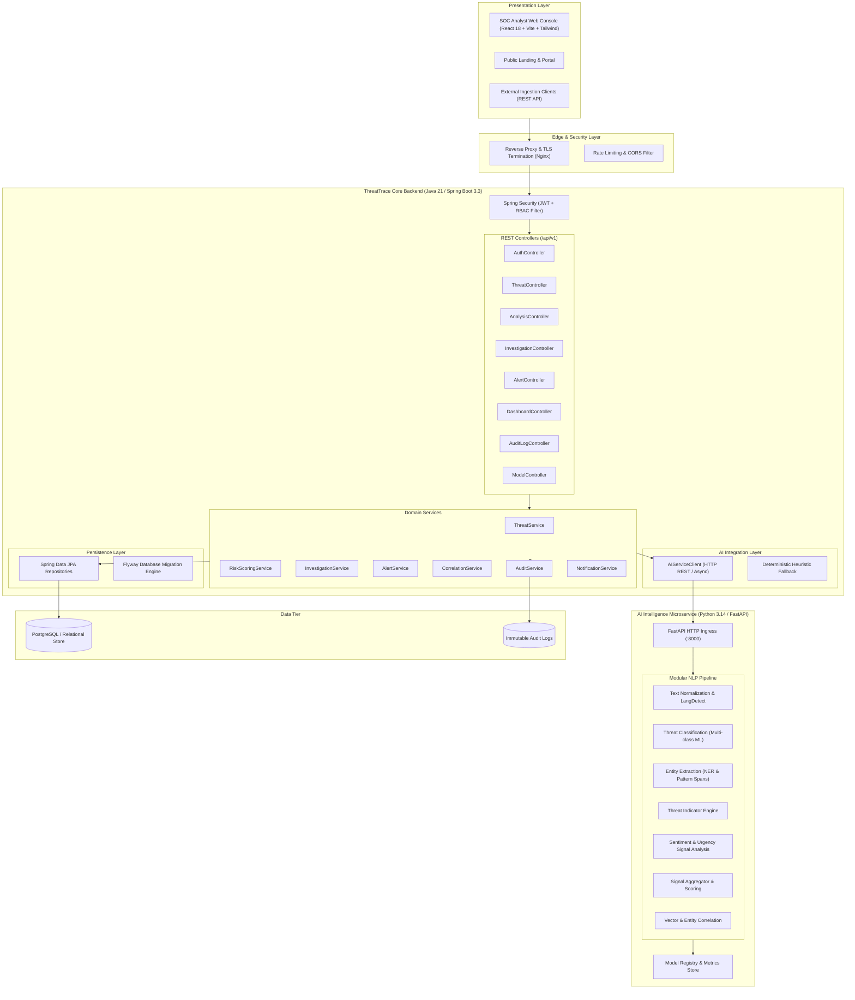

# ThreatTrace AI — System Architecture Specification

## 1. Executive Summary & Product Identity

**Product Name:** ThreatTrace AI  
**Tagline:** AI-Powered Threat Intelligence & Risk Analysis  
**Repository:** https://github.com/Cy-prog/ThreatTrace-AI.git

ThreatTrace AI is an enterprise-grade threat intelligence and security operations platform designed for Security Operations Centers (SOCs), threat intelligence units, law enforcement intelligence analysts, and security researchers. It ingests unstructured text and threat reports from heterogeneous sources (emails, web reports, social feeds, user tips, API webhooks, files) and executes an AI-assisted analysis pipeline.

### Core Analytical Mandate: Non-Autonomous, Explainable Intelligence
ThreatTrace AI operates under strict analytical governance:
1. **Never Present AI Predictions as Fact:** Every output cleanly separates *observed evidence*, *extracted entities*, *model predictions*, *confidence scores*, *risk signals*, and *human verification status*.
2. **Transparent Risk Scoring:** Risk scores (0–100) are computed through an explainable multi-signal engine where every point is traceable to explicit linguistic, temporal, target, and classification factors.
3. **Human-in-the-Loop Governance:** Analysts retain sovereign decision authority. Threats are flagged with verification states (`REQUIRES_HUMAN_REVIEW`, `VERIFIED_BY_ANALYST`, `FALSE_POSITIVE`, `RESOLVED`).

---

## 2. High-Level System Architecture

---

## 3. Technology Stack Decisions

| Layer | Selected Technology | Technical Rationale |
|---|---|---|
| **Backend Core** | Java 21 LTS + Spring Boot 3.3 | Enterprise-grade reliability, strong typing, mature security ecosystem, high concurrency with Virtual Threads, native JPA transactions. |
| **Security & Auth** | Spring Security 6 + JWT + BCrypt | Stateless, scalable token authentication with server-side RBAC enforcement (`ADMIN`, `ANALYST`, `INVESTIGATOR`, `VIEWER`). |
| **Database & ORM** | PostgreSQL 16 / H2 + Spring Data JPA + Flyway | ACID guarantees, spatial query readiness for geographic coordinates, automated versioned database migrations without reliance on Hibernate DDL generation. |
| **AI / NLP Microservice** | Python 3.14 + FastAPI + Pydantic + scikit-learn + TextBlob + NLTK | High-throughput asynchronous REST inference, rich NLP ecosystem, modular pipeline design with typed Pydantic contracts. |
| **Frontend Application** | React 18 + TypeScript + Vite + Tailwind CSS + Lucide Icons | High-performance SPA, strict compile-time type safety, modular component architecture, dense SOC command-center UX. |
| **State & Data Fetching** | React Context + Custom Hooks + Axios with Interceptors | Centralized token management, automatic header injection, structured error handling and loading states. |
| **Visualizations & Maps** | Leaflet / React-Leaflet + Lucide Icons + SVG Charts | Clean, lightweight geographic map plotting only validated entities without external tracking dependencies. |
| **Containerization** | Multi-stage Docker + Docker Compose | Reproducible environments for local development and production deployments. |

---

## 4. Security & Compliance Architecture

1. **Authentication:**
   - PBKDF2 / BCrypt password hashing (12 rounds).
   - Ephemeral JWT Access Tokens (15m expiry) and Refresh Tokens (7d expiry) signed with HMAC-SHA256.
   - Endpoint protection at the security filter chain level; role enforcement via `@PreAuthorize`.

2. **Server-Side Authorization Matrix:**
   - `ADMIN`: Full system administration, user management, audit logs, model registry updates.
   - `INVESTIGATOR`: Create & manage investigations, write analyst notes, export reports, reassign threats.
   - `ANALYST`: Ingest threats, execute analysis, acknowledge alerts, inspect entities.
   - `VIEWER`: Read-only access to dashboard, threats, and non-sensitive metadata.

3. **Data Protection & Sanitization:**
   - Content length validation (minimum 5 chars, maximum 100,000 chars per submission).
   - Cross-Site Scripting (XSS) prevention via contextual HTML encoding on output.
   - SQL Injection immunity via parameterized JPA queries.
   - Upload restrictions: Strict MIME type validation, file size limits (max 10MB), non-executable storage.
   - No sensitive passwords, tokens, or PII logged to standard out or audit streams.

4. **Immutable Audit Logging:**
   - Every state change (`THREAT_CREATED`, `THREAT_ANALYZED`, `INVESTIGATION_STATUS_CHANGED`, `ALERT_ACKNOWLEDGED`, `LOGIN_ATTEMPT`) produces a persistent, tamper-evident audit record recording `actor`, `action`, `resourceId`, `ipAddress`, and `metadata`.
