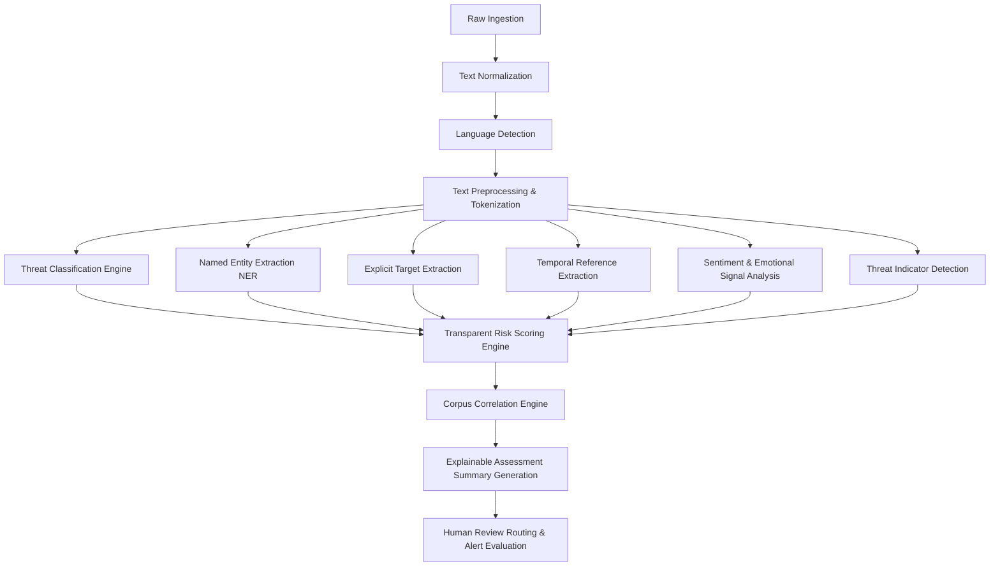

# ThreatTrace AI — Threat Analysis & Risk Engine Pipeline

## 1. Modular Pipeline Sequence

Every submitted threat report undergoes an explainable 13-stage analytical pipeline:



---

## 2. Threat Classification Categories

The classifier distinguishes 13 distinct functional categories:

1. `VIOLENT_THREAT`: Explicit or implicit threats of physical harm, assault, murder, or mass casualties.
2. `BOMB_THREAT`: Threats referencing explosive devices, detonation, bomb scares, or sabotage.
3. `WEAPON_REFERENCE`: Mentions of firearms, blades, tactical weapons, or hazardous materials.
4. `HARASSMENT`: Repetitive abusive communication, targeted insults, intimidating rhetoric.
5. `EXTORTION`: Coercion demanding monetary funds, credentials, or actions under threat of exposure or harm.
6. `STALKING`: Surveillance signals, persistent unwanted tracking, physical proximity monitoring.
7. `CYBER_THREAT`: Ransomware threats, DDoS warnings, unauthorized system access, data exfiltration notices.
8. `FRAUD`: Deceptive schemes, credential phishing, financial deception.
9. `PHISHING`: Social engineering attempts, credential-harvesting lures, malicious links.
10. `PUBLIC_SAFETY_THREAT`: Broad threats targeting infrastructure, transit, schools, or public events.
11. `SELF_HARM_SIGNAL`: Distress indicators indicating intentional self-harm or suicidal ideation.
12. `NON_THREAT`: Benign communication, everyday operational messages, false alarms.
13. `UNKNOWN`: Inconclusive input requiring manual triage.

Each classification produces:
- `predicted_category`: Primary category
- `confidence`: Calibrated probability score (0.00 – 1.00)
- `category_probabilities`: Complete probability distribution over all categories
- `model_name` & `model_version`: Exact deployed artifact metadata

---

## 3. Entity Extraction & Spans

Extracted entities capture both standard linguistic NER types and cybersecurity domain entities:
- `PERSON`: Individual names, aliases, handles
- `ORGANIZATION`: Companies, institutions, government bodies
- `LOCATION`: Cities, countries, geographic points
- `FACILITY`: Buildings, airports, schools, server centers, transit stations
- `DATE` & `TIME`: Explicit calendar days, deadlines, timestamps
- `PHONE`: E.164 and localized telephone numbers
- `EMAIL`: Email addresses
- `URL`: Domains, hyperlinks, IP addresses
- `VEHICLE`: Vehicle descriptions, license plates
- `EVENT`: Scheduled gatherings, conferences, public hearings

### Span Structure
Every extracted entity retains precise zero-indexed source spans for interactive analyst UI highlighting:
```json
{
  "type": "FACILITY",
  "value": "Central Metro Station",
  "confidence": 0.94,
  "startOffset": 45,
  "endOffset": 66,
  "sourceSpan": "Central Metro Station"
}
```

---

## 4. Threat Indicator Detection

Linguistic and situational indicators are identified with exact evidence spans:
- `THREAT_LANGUAGE`: Direct declarative harm vocabulary ("kill", "destroy", "eliminate", "detonate").
- `TARGET_REFERENCE`: Explicit individuals, groups, or facilities named as targets.
- `TEMPORAL_REFERENCE`: Imminent deadlines ("in 2 hours", "tonight", "tomorrow at 9am").
- `LOCATION_REFERENCE`: Specific coordinates, street addresses, or landmarks identified.
- `WEAPON_REFERENCE`: Explicit naming of firearms, explosives, chemical agents, or cyber exploits.
- `DEMAND_LANGUAGE`: Ultimatums, extortion terms ("pay 5 BTC or else", "transfer funds").
- `IMMINENCE_SIGNAL`: High-urgency temporal markers indicating short reaction windows.
- `REPEATED_CONTACT`: Patterns indicative of persistent harassment campaigns.
- `ESCALATION_SIGNAL`: Progressive intensity markers compared to previous baseline communications.

---

## 5. Transparent Risk Scoring Formula

The Risk Score (0–100) is calculated strictly through an additive, weighted signal model:

$$\text{RiskScore} = \min\left(100, \sum_{i} w_i \cdot s_i\right)$$

### Contributing Signal Weights:
| Factor | Maximum Signal Contribution | Conditions |
|---|---|---|
| **Base Category Threat Weight** | 0 – 35 pts | `BOMB_THREAT` (35), `VIOLENT_THREAT` (30), `CYBER_THREAT` (25), `EXTORTION` (22), `HARASSMENT` (15), `FRAUD` (10), `NON_THREAT` (0) |
| **Model Classification Confidence** | 0 – 10 pts | Scales with prediction confidence: $\text{Confidence} \times 10$ |
| **Explicit Target Named** | 0 – 15 pts | High specificity target entity detected (+15), general (+8) |
| **Specific Location / Facility** | 0 – 12 pts | Exact facility or geographic location identified |
| **Temporal Imminence** | 0 – 15 pts | Imminent time horizon (<24 hrs: +15, specified date: +8) |
| **Weapon / Payload Identified** | 0 – 10 pts | Explicit lethal or disruptive instrument identified |
| **Demand / Ultimatums** | 0 – 8 pts | Extortion or coercive demands present |
| **Emotional Urgency & Aggression** | 0 – 5 pts | High aggression/anger lexical polarity |

### Severity Tier Thresholds:
- **CRITICAL**: 80 – 100
- **HIGH**: 60 – 79
- **MEDIUM**: 35 – 59
- **LOW**: 0 – 34

Each analysis response includes an explicit breakdown array:
```json
"signalBreakdown": [
  {"signal": "Base Category (VIOLENT_THREAT)", "points": 30, "detail": "High-risk category detected"},
  {"signal": "Explicit Target Identified", "points": 15, "detail": "Named organization 'Apex Tech HQ'"},
  {"signal": "Temporal Imminence", "points": 12, "detail": "Deadline referenced: 'tomorrow at 9am'"},
  {"signal": "Threat Language Intensity", "points": 10, "detail": "Direct declarative violent rhetoric"}
]
```
