# ThreatTrace AI — Database Entity-Relationship Specification (ERD)

## 1. Relational Entity Overview

The ThreatTrace AI database schema is designed for PostgreSQL with UUID primary keys, explicit foreign key constraints, high-selectivity indexes, audit integrity, and temporal tracking.

```mermaid
erDiagram
    USERS ||--o{ INVESTIGATIONS : "assigned to"
    USERS ||--o{ AUDIT_LOGS : "performs"
    USERS ||--o{ THREATS : "reported by"
    ROLES ||--o{ USER_ROLES : "assigned"
    USERS ||--o{ USER_ROLES : "has"

    THREATS ||--|| THREAT_ANALYSES : "produces"
    THREAT_ANALYSES ||--o{ THREAT_ENTITIES : "contains"
    THREAT_ANALYSES ||--o{ THREAT_INDICATORS : "contains"
    
    THREATS ||--o{ INVESTIGATIONS : "escalates to"
    THREATS ||--o{ ALERTS : "triggers"
    THREATS ||--o{ THREAT_RELATIONS : "source threat"
    THREATS ||--o{ THREAT_RELATIONS : "target threat"

    INVESTIGATIONS ||--o{ INVESTIGATION_NOTES : "contains"
    INVESTIGATIONS ||--o{ INVESTIGATION_EVIDENCE : "contains"

    MODEL_VERSIONS ||--o{ THREAT_ANALYSES : "analyzed by"

    USERS {
        uuid id PK
        varchar username UK
        varchar email UK
        varchar password_hash
        varchar full_name
        boolean enabled
        timestamp created_at
        timestamp updated_at
    }

    ROLES {
        uuid id PK
        varchar name UK
        varchar description
    }

    THREATS {
        uuid id PK
        varchar threat_reference UK "e.g. THR-2026-000101"
        varchar source_type "EMAIL, WEB_REPORT, SOCIAL_MEDIA, MESSAGE, USER_REPORT, API, FILE_UPLOAD"
        varchar source_reference
        text raw_content
        varchar status "PENDING, ANALYZED, IN_REVIEW, ESCALATED, RESOLVED, FALSE_POSITIVE"
        varchar location_name
        double_precision latitude
        double_precision longitude
        boolean geo_verified
        uuid reported_by FK
        timestamp submitted_at
        timestamp created_at
        timestamp updated_at
    }

    THREAT_ANALYSES {
        uuid id PK
        uuid threat_id FK,UK
        varchar predicted_category
        double_precision confidence
        integer risk_score "0-100"
        varchar severity "LOW, MEDIUM, HIGH, CRITICAL"
        varchar sentiment_label
        double_precision sentiment_score
        double_precision urgency_score
        text explanation_summary
        jsonb signal_breakdown
        varchar model_name
        varchar model_version
        boolean human_review_required
        timestamp analyzed_at
    }

    THREAT_ENTITIES {
        uuid id PK
        uuid analysis_id FK
        varchar entity_type "PERSON, ORGANIZATION, LOCATION, FACILITY, DATE, TIME, PHONE, EMAIL, URL, VEHICLE, EVENT"
        varchar entity_value
        double_precision confidence
        integer start_offset
        integer end_offset
        varchar source_span
    }

    THREAT_INDICATORS {
        uuid id PK
        uuid analysis_id FK
        varchar indicator_type "THREAT_LANGUAGE, TARGET_REFERENCE, TEMPORAL_REFERENCE, LOCATION_REFERENCE, WEAPON_REFERENCE, DEMAND_LANGUAGE, IMMINENCE_SIGNAL, REPEATED_CONTACT, ESCALATION_SIGNAL"
        varchar label
        double_precision weight
        text evidence_snippet
    }

    INVESTIGATIONS {
        uuid id PK
        varchar investigation_reference UK "e.g. INV-2026-000042"
        uuid threat_id FK
        uuid assigned_analyst_id FK
        varchar priority "LOW, MEDIUM, HIGH, CRITICAL"
        varchar status "OPEN, IN_REVIEW, ESCALATED, RESOLVED, FALSE_POSITIVE, CLOSED"
        text title
        text summary
        text resolution_notes
        timestamp created_at
        timestamp updated_at
        timestamp closed_at
    }

    INVESTIGATION_NOTES {
        uuid id PK
        uuid investigation_id FK
        uuid author_id FK
        text content
        timestamp created_at
    }

    ALERTS {
        uuid id PK
        varchar alert_reference UK "e.g. ALT-2026-000088"
        uuid threat_id FK
        varchar alert_type "HIGH_RISK_THRESHOLD, CRITICAL_SEVERITY, RAPID_CLUSTER, REPEATED_TARGET"
        varchar severity "LOW, MEDIUM, HIGH, CRITICAL"
        varchar status "OPEN, ACKNOWLEDGED, RESOLVED, DISMISSED"
        uuid acknowledged_by FK
        timestamp acknowledged_at
        timestamp created_at
    }

    THREAT_RELATIONS {
        uuid id PK
        uuid source_threat_id FK
        uuid target_threat_id FK
        double_precision similarity_score "0.0 - 1.0"
        varchar correlation_reason "SHARED_LOCATION, SHARED_TARGET, SEMANTIC_SIMILARITY, TEMPORAL_PROXIMITY"
        jsonb metadata
        timestamp created_at
    }

    MODEL_VERSIONS {
        uuid id PK
        varchar model_name
        varchar model_version
        varchar model_type "TRANSFORMER, ENSEMBLE, TFIDF_LOGISTIC, HEURISTIC"
        varchar training_dataset
        jsonb evaluation_metrics
        varchar status "ACTIVE, CANDIDATE, DEPRECATED"
        timestamp deployed_at
    }

    AUDIT_LOGS {
        uuid id PK
        varchar actor
        varchar action "LOGIN, LOGOUT, THREAT_CREATED, THREAT_ANALYZED, THREAT_VIEWED, THREAT_ASSIGNED, THREAT_ESCALATED, THREAT_REVIEWED, ALERT_CREATED, ALERT_ACKNOWLEDGED, USER_CREATED, ROLE_CHANGED"
        varchar resource_type
        varchar resource_id
        varchar ip_address
        jsonb metadata
        timestamp created_at
    }
```

